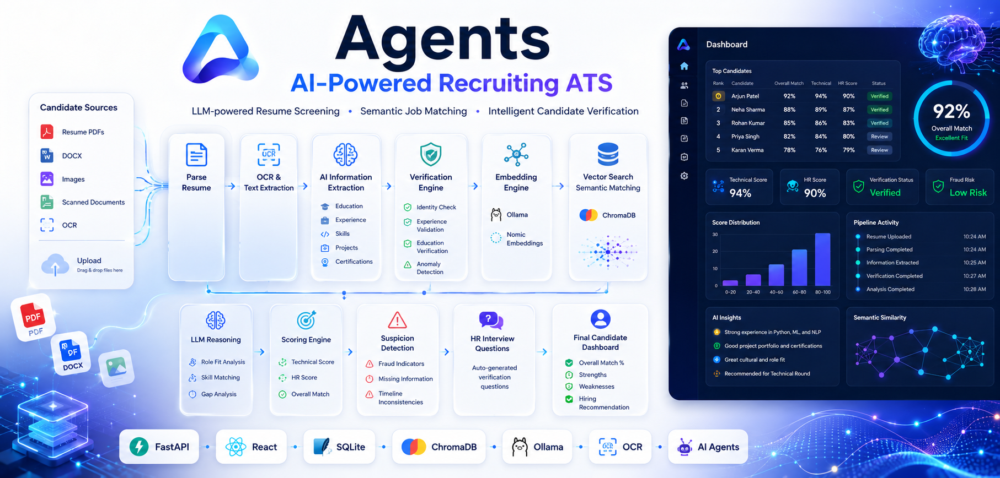
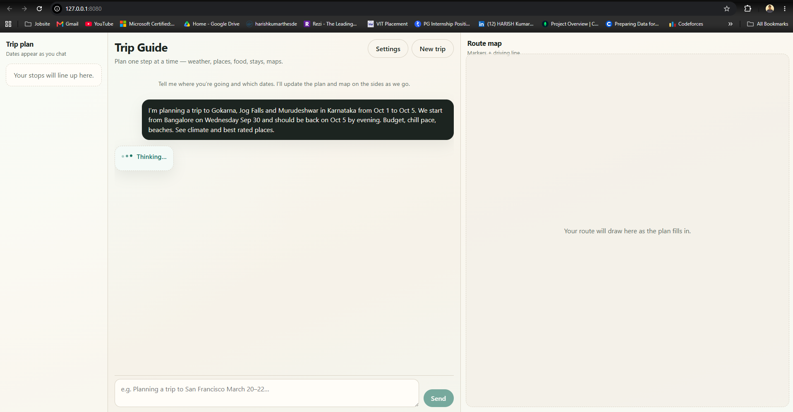

# Agents

Monorepo for AI agent projects by [Harish-nika](https://github.com/Harish-nika).

Each agent lives in its own folder with its own README, dependencies, and deploy scripts.

---

## Projects

| Folder | Description | Docs |
|--------|-------------|------|
| [`recruiting-agent/`](recruiting-agent/) | AI-powered ATS — resume scoring, JD matching, HR verification | [Setup guide](recruiting-agent/README.md) |
| [`Trip_planner-agent/`](Trip_planner-agent/) | Trip Guide — multi-agent travel chat, spine + map, free tools | [Setup guide](Trip_planner-agent/README.md) |

[](recruiting-agent/README.md)

[](Trip_planner-agent/README.md)

---

## Clone the repo

```bash
git clone https://github.com/Harish-nika/Agents.git
cd Agents
```

Then open the agent you need:

```bash
cd recruiting-agent
# follow recruiting-agent/README.md

cd ../Trip_planner-agent
# follow Trip_planner-agent/README.md
```

---

## Adding a new agent

1. Create a folder: `your-agent-name/`
2. Add a `README.md` with setup instructions
3. Add agent-specific `.gitignore` entries if needed (root `.gitignore` covers common patterns)
4. List it in the table above

---

## License

MIT — see [LICENSE](LICENSE).
