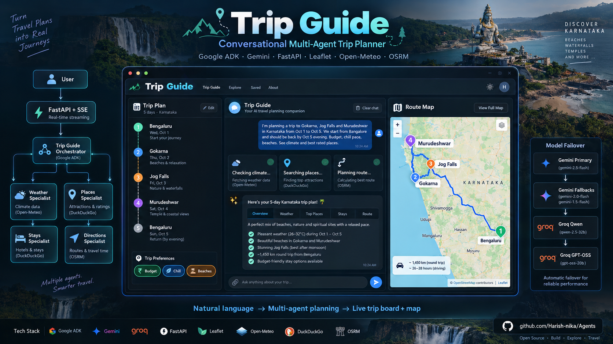
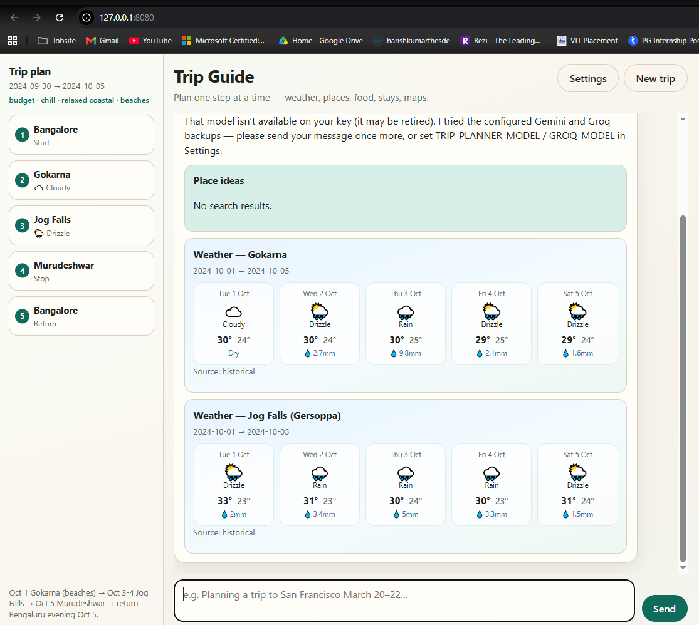
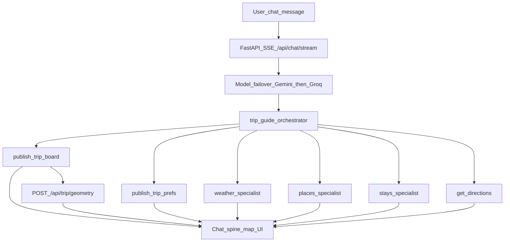

# Trip Guide — Conversational Trip Planner (Google ADK)



Multi-agent travel assistant that understands multi-stop trips from natural language, updates a live **trip board + map**, and delegates climate / places / stays to specialist agents. Built for a mostly free stack (Open-Meteo, DuckDuckGo, OSM/OSRM, optional Groq).

**Stack:** FastAPI · Google ADK · Gemini (primary) · [Groq](https://console.groq.com) fallback · Leaflet · Open-Meteo · DuckDuckGo · OSRM

**Repository:** [github.com/Harish-nika/Agents](https://github.com/Harish-nika/Agents)

---

## Models: Gemini first, Groq fallback

**Yes — Gemini is always tried first; Groq is the fallback.**

Default failover order in `trip_planner/config.py` → `model_candidates()`:

| Order | Model | Role |
|-------|--------|------|
| 1 | `gemini-3.6-flash` | Primary (AI Studio) |
| 2 | `gemini-flash-latest` | Gemini fallback |
| 3 | `gemini-2.0-flash` | Gemini fallback |
| 4 | `groq/qwen/qwen3.8-27b` | Groq tool-capable fallback (~27B) |
| 5 | `groq/openai/gpt-oss-20b` | Groq last resort |

- Groq runs only if `GROQ_API_KEY` or `grok_key` is set.
- Chat service retries the next model on **503 / busy / not found / rate limit**.
- **`groq/compound` is not an agent model** (no OpenAI-style tool calling). It is used only via the `compound_research` tool when your Groq project allows Compound’s underlying models.

Retired Gemini IDs (`gemini-1.5-*`, `gemini-2.5-flash`) are skipped automatically.

---

## Screenshots

### Live three-column layout

Left **Trip plan** spine · center **Trip Guide** chat · right **Route map**. Empty panels fill as the agent publishes the board, weather, places, and geometry.


Example prompt shown in the screenshot:

```text
I'm planning a trip to Gokarna, Jog Falls and Murudeshwar in Karnataka from Oct 1 to Oct 5.
We start from Bangalore on Wednesday Sep 30 and should be back on Oct 5 by evening.
Budget, chill pace, beaches. See climate and best rated places.
```

### Trip board + climate cards filled

After tools run: left spine shows ordered stops (Bangalore → Gokarna → Jog Falls → Murudeshwar → return), prefs strip (`budget · chill · beaches`), and weather timelines for Gokarna / Jog Falls in the chat.



---

## Tech stack

| Layer | Technology |
|-------|------------|
| Agent runtime | [Google ADK](https://google.github.io/adk-docs/) (`Agent`, `AgentTool`, `Runner`) |
| Primary LLM | Google Gemini (AI Studio / `GOOGLE_API_KEY`) |
| Fallback LLM | Groq via ADK LiteLLM (`grok_key` / `GROQ_API_KEY`) |
| API | FastAPI + SSE (`/api/chat/stream`) |
| UI | Static HTML/CSS/JS — three-column shell |
| Map | Leaflet + OpenStreetMap tiles |
| Route geometry | Public OSRM (`/api/trip/geometry` proxy) |
| Weather | Open-Meteo (geocode + forecast/archive) |
| Places / food / stays | DuckDuckGo text search (+ optional Compound research) |
| Directions | Google Directions API (optional) + always Open-in-Maps URL |
| Config | `.env` + in-app Settings |

---

## Agents and agent types

Live chat path uses **one orchestrator + three specialist agents** wired as **ADK `AgentTool`s** (not SequentialAgent/ParallelAgent on the UI path).

| Agent | Type | Job | Tools |
|-------|------|-----|-------|
| `trip_guide` | **Orchestrator** (`Agent` + tools) | Understand trip, update UI state, delegate, merge reply | `publish_trip_board`, `publish_trip_prefs`, `get_directions`, AgentTools below |
| `weather_specialist` | **Specialist** (`Agent` via `AgentTool`) | Climate for stops/dates | `get_weather_for_dates`, `get_live_weather_forecast` |
| `places_specialist` | **Specialist** (`Agent` via `AgentTool`) | Attractions / best-rated places | `suggest_places`, `compound_research`, `web_search` |
| `stays_specialist` | **Specialist** (`Agent` via `AgentTool`) | Food + lodging when asked | `suggest_food`, `search_lodging`, `compound_research` |

**Legacy / learning only** (CLI `trip_planner.main`, notebooks — not the web UI):

| Agent / workflow | Type |
|------------------|------|
| `router_agent` + workers | Router → day_trip / foodie / multi_day / … |
| `find_and_navigate_agent` | `SequentialAgent` |
| `iterative_planner_agent` | `SequentialAgent` + `LoopAgent` |
| `parallel_planner_agent` | `ParallelAgent` inside `SequentialAgent` |
| `trip_data_concierge` | Nested `AgentTool` hierarchy |

---

## End-to-end planning flow



**Step-by-step (happy path)**

1. User sends destination(s), dates, prefs, and what they want (climate, places, …).
2. SSE starts: UI shows **Thinking…** then tool status labels.
3. Orchestrator calls **`publish_trip_board`** → left spine + map geocode/OSRM polyline.
4. If prefs stated → **`publish_trip_prefs`** → prefs strip (budget · chill · beaches).
5. Same turn: **`weather_specialist`** and/or **`places_specialist`** (and stays if asked).
6. Cards stream into chat (weather timeline, places with **clickable reference links**).
7. Orchestrator writes a short merged answer and offers one next step.
8. If Gemini fails (503/retired), chat service retries Gemini fallbacks, then Groq.

---

## Features shipped

| Area | What you get |
|------|----------------|
| **Multi-stop NLU** | Typos OK (banglore → Bengaluru, murdeshara → Murudeshwar) |
| **Ask / act** | Does requested work in one turn when climate+places are asked together |
| **Trip spine** | Ordered stops, dates, weather chips, click-to-focus on map |
| **Route map** | Numbered markers + teal driving route (OSRM), empty-state copy |
| **Mobile** | Plan \| Chat \| Map tabs under ~900px |
| **Preferences** | Session budget / pace / vibe / interests / companions |
| **Citations** | Place/food/lodging cards with DuckDuckGo URLs |
| **Streaming UX** | Status: Updating trip board… Checking climate… Searching places… |
| **Settings** | Gemini + Groq + Maps keys saved to server `.env` |
| **Model resilience** | Gemini → Gemini fallbacks → Groq Qwen → Groq gpt-oss |
| **Free tools** | Weather, search, OSM tiles, OSRM — no Maps JS billing required for the side map |

---

## Features / roadmap notes

| Done | Later (optional) |
|------|------------------|
| In-session chat memory (ADK) | Durable login + SQLite cross-trip memory |
| Session prefs strip | Learned recommendation engine |
| Place reference links | Richer lodging booking deep-links |
| Compound as research tool | Enable Compound’s models in Groq project settings |
| Legacy Sequential/Parallel demos | Wire ParallelAgent into live chat if desired |

---

## Quick start

### 1. Clone

```bash
git clone https://github.com/Harish-nika/Agents.git
cd Agents/Trip_planner-agent
```

### 2. Prerequisites

- Python 3.10+ (`requirements.txt` includes `google-adk`)
- [Google AI Studio](https://aistudio.google.com/apikey) key (Gemini)
- Optional: [Groq](https://console.groq.com/keys) key (`gsk_…` / `grok_key`)
- Optional: Google Maps key for detailed Directions steps

### 3. Secrets (never commit)

```bash
cp .env.example .env
# Set GOOGLE_API_KEY at minimum; add grok_key for Groq fallback
```

| File | Purpose | In git? |
|------|---------|---------|
| `.env` | Gemini, Groq, Maps | **No** |
| `.env.example` | Placeholders | Yes |

### 4. Run

```bash
python3 -m venv .venv
source .venv/bin/activate
pip install -r requirements.txt

PYTHONPATH=. python3 -m uvicorn trip_planner.api.app:app --host 127.0.0.1 --port 8080
```

Or `./scripts/run_server.sh`. Open **http://127.0.0.1:8080** (hard-refresh after updates).

---

## Example prompt

```text
I'm planning a trip to Gokarna, Jog Falls and Murudeshwar in Karnataka from Oct 1 to Oct 5.
We start from Bangalore on Wednesday Sep 30 and should be back on Oct 5 by evening.
Budget, chill pace, beaches. See climate and best rated places.
```

Expect: prefs strip, trip spine, map route, weather cards, places with reference links.

---

## CLI (optional)

```bash
PYTHONPATH=. python -m trip_planner.chat_cli
PYTHONPATH=. python -m trip_planner.main --list-routes
```

---

## Package layout

| Path | Role |
|------|------|
| `trip_planner/agents/trip_concierge.py` | Orchestrator + AgentTools |
| `trip_planner/agents/guide_team.py` | Weather / places / stays specialists |
| `trip_planner/api/app.py` | FastAPI chat + geometry + static UI |
| `trip_planner/runtime/chat_service.py` | Sessions, SSE, model failover |
| `trip_planner/tools/` | Weather, maps, search, board, prefs, Compound |
| `trip_planner/config.py` | Gemini + Groq model candidates |
| `web/` | Three-column UI (Leaflet) |
| `page_images/` | README screenshots |
| `trip_planner/workflows/` | Legacy Sequential / Parallel / Loop demos |

---

## License

MIT — see the monorepo [LICENSE](../LICENSE).
