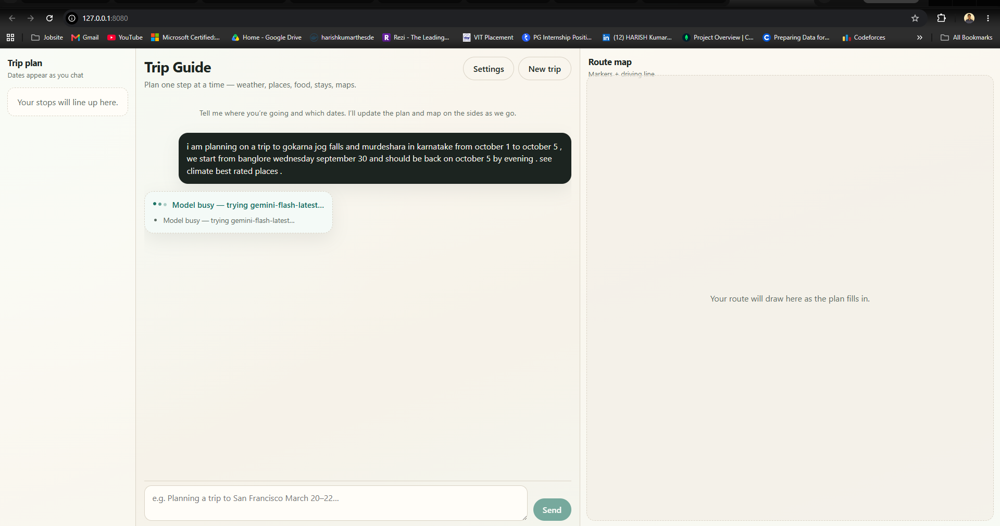

# Trip Guide — Conversational Trip Planner (Google ADK)



Multi-agent travel assistant that understands multi-stop trips from natural language, updates a live **trip board + map**, and delegates climate / places / stays to specialist agents. Free-stack tools (Open-Meteo, DuckDuckGo, OSM/OSRM, optional Groq).

**Stack:** FastAPI · Google ADK · Gemini (primary) · [Groq](https://console.groq.com) fallback · Leaflet · Open-Meteo · DuckDuckGo · OSRM

**Repository:** [github.com/Harish-nika/Agents](https://github.com/Harish-nika/Agents)

---

## Features

| Feature | Description |
|---------|-------------|
| **Trip Guide chat** | Multi-turn planning with streaming status (“Checking climate…”) |
| **Multi-agent team** | Orchestrator + weather / places / stays specialists (AgentTools) |
| **Trip spine** | Left timeline of ordered stops with weather chips |
| **Route map** | Right Leaflet map — numbered markers + OSRM driving polyline |
| **Trip board tool** | `publish_trip_board` pushes origin, stops, dates to the UI |
| **Preferences** | Budget / pace / vibe / interests saved for the session |
| **Place citations** | Search cards with clickable reference links |
| **Climate** | Open-Meteo date-range weather (no paid weather API) |
| **Maps** | Google Directions when keyed; always an Open-in-Maps link |
| **Groq fallback** | Tool-capable models when Gemini is busy; Compound as research tool |
| **Settings UI** | Paste Gemini / Groq / Maps keys — saved to server `.env` |

---

## Screenshots

### Three-column desktop layout

Chat in the center, trip plan on the left, route map on the right.


---

## Quick start

### 1. Clone

```bash
git clone https://github.com/Harish-nika/Agents.git
cd Agents/Trip_planner-agent
```

### 2. Prerequisites

- Python 3.10+ with packages from `requirements.txt` (includes `google-adk`)
- A [Google AI Studio](https://aistudio.google.com/apikey) API key (Gemini)
- Optional: [Groq](https://console.groq.com/keys) key for LLM fallback (`gsk_…`, also accepted as `grok_key`)
- Optional: [Google Maps](https://console.cloud.google.com/) key for detailed Directions steps

### 3. Secrets (never commit)

```bash
cp .env.example .env
# Edit .env — set GOOGLE_API_KEY at minimum
```

| File | Purpose | In git? |
|------|---------|---------|
| `.env` | Gemini, Groq (`grok_key` / `GROQ_API_KEY`), Maps | **No** |
| `.env.example` | Documented placeholders | Yes |

**Groq tip:** Prefer `qwen/qwen3.8-27b` (or set `GROQ_MODEL`) for ADK tool calling. `groq/compound` has unlimited daily tokens but **does not support** OpenAI-style tool calling — Trip Guide uses it only via the `compound_research` tool when project models allow it.

### 4. Install and run

```bash
python3 -m venv .venv
source .venv/bin/activate
pip install -r requirements.txt

# Important: use python3 -m uvicorn so ADK resolves on the right interpreter
PYTHONPATH=. python3 -m uvicorn trip_planner.api.app:app --host 127.0.0.1 --port 8080
```

Or:

```bash
chmod +x scripts/run_server.sh
./scripts/run_server.sh
```

Open **http://127.0.0.1:8080** — hard-refresh after updates.

- **Settings** — paste keys (saved to `.env` on the server)
- **New trip** — clears chat session + side panels
- Same browser tab keeps `session_id` in `localStorage`; prefs in `sessionStorage`

---

## Example prompt

```text
Planning a trip to Gokarna, Jog Falls and Murudeshwar from Bangalore,
Sep 30 – Oct 5, budget chill beaches — see climate and best rated places
```

Expect: trip board + map route, weather cards, places with **reference links**, prefs strip on the left.

---

## How it works

```text
User message
    → trip_guide (orchestrator)
        → publish_trip_board / publish_trip_prefs
        → weather_specialist  (Open-Meteo)
        → places_specialist   (DuckDuckGo + optional Compound research)
        → stays_specialist    (food / lodging when asked)
        → get_directions      (Maps link ± Directions API)
    → SSE stream → chat UI + spine + Leaflet map
```

Model failover: Gemini primary → Gemini fallbacks → Groq tool-capable models (`qwen3.8-27b`, then `gpt-oss-20b`).

---

## CLI (optional)

```bash
# Same Trip Guide agent as the UI
PYTHONPATH=. python -m trip_planner.chat_cli

# Legacy one-shot router (notebook-style demos)
PYTHONPATH=. python -m trip_planner.main --list-routes
PYTHONPATH=. python -m trip_planner.main "Find sushi in Palo Alto"
```

---

## Package layout

| Path | Role |
|------|------|
| `trip_planner/agents/trip_concierge.py` | Orchestrator + AgentTools |
| `trip_planner/agents/guide_team.py` | Weather / places / stays specialists |
| `trip_planner/api/app.py` | FastAPI chat + `/api/trip/geometry` + static UI |
| `trip_planner/runtime/chat_service.py` | Sessions, streaming, model failover |
| `trip_planner/tools/` | Weather, maps, search, trip board, prefs, Compound research |
| `web/` | Three-column chat UI (Leaflet) |
| `trip_planner/workflows/` | Legacy Sequential / Parallel / Loop demos |

---

## Learning notebooks

- `lesson_1_ADK_Learning_1.ipynb` — tools & memory
- `ADK_Learning_2.ipynb` — multi-agent workflows

---

## License

MIT — see the monorepo [LICENSE](../LICENSE).
